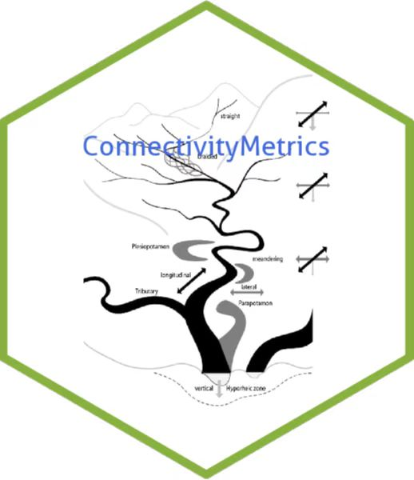

# connectivitymetrics # 
The connectivitymetrics package was developed in order to calculate river multi connectivity metrics, assisting in research on river fragmentation analysis.

### Contributing

One of the major motivations behind **connectivitymetrics** is the idea to provide an open-source code collection of connectivity metrics.
